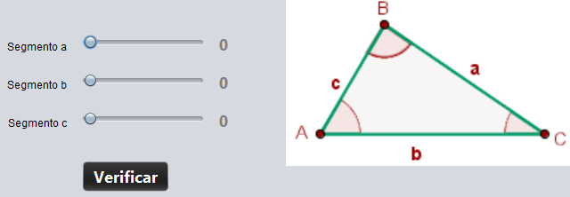
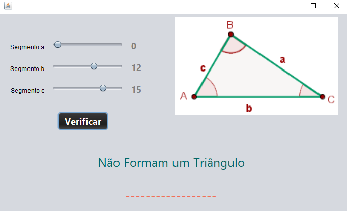
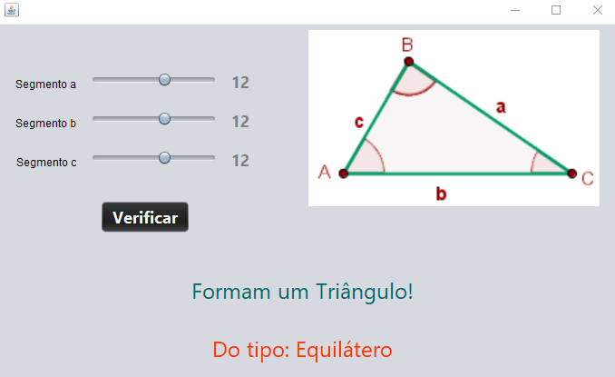
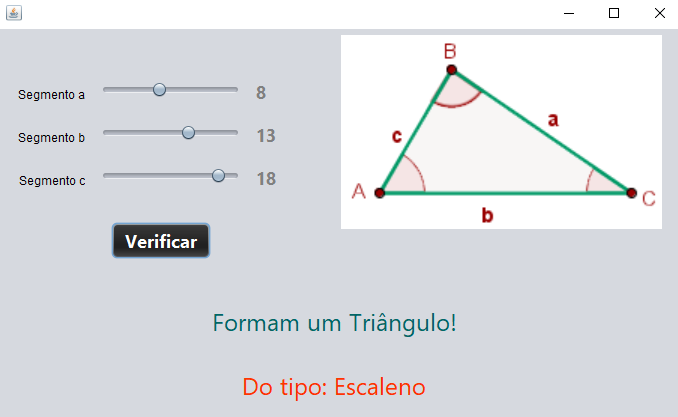
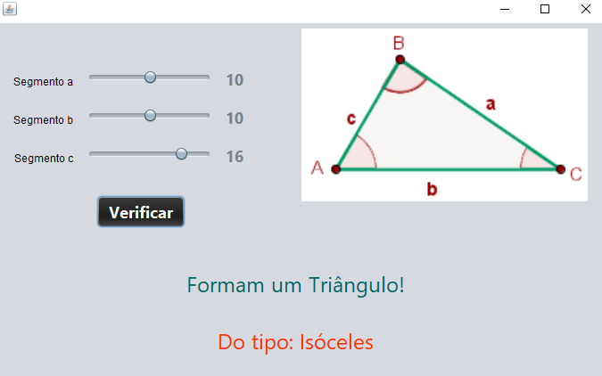

## Projeto Triângulo 🔺

  

### Java - Curso em Vídeo ☕▶

<strong>Projeto Trângulo</strong> desenvolvido na Aula 10 do Curso de Java do Curso em Vídeo. Nesse projeto utilizamos a tecnologia <strong>Swing</strong> e programamos os elementos da Interface Gráfica, sendo possível o usuário escolher 3 números através dos sliders e assim conseguir identificar se os três valores escolhidos formam um triângulo e o tipo que ele é.

  
  

  
## Compilação 👨🏽‍💻

### Tela - Não forma Triângulo

  

### Tela - Triângulo Equilátero

  

### Tela - Triângulo Escaleno

  

### Tela - Triângulo Isóceles

  

## Tecnologias 🛠

- Java ☕

## Instrutor 👨🏽‍🏫
- <a target="_blank" href="https://www.linkedin.com/in/guanabara/">Gustavo Guanabara</a>

## Aluno 👨🏽‍🎓

- <a target="_blank" href="https://www.linkedin.com/in/ramon-barreto-076191180/">Ramon Barreto</a>

## Contato 📲

- Email: ramon_barreto_medrado@hotmail.com